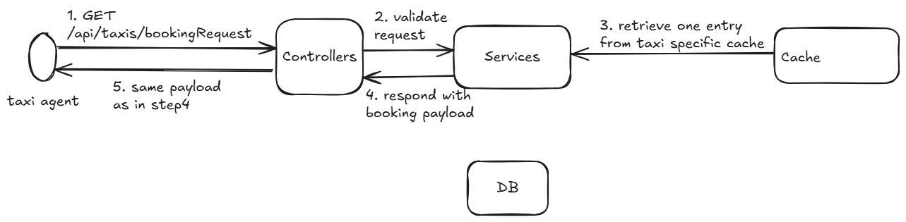

This is a partial implementation of taxi booking lifecycle. Currently, it allows posting of new bookings and accepting
bookings
by
taxi agent. This application still lags implementation features like payload validation, payload enrichment(possibly
hitting
another service) and API to indicate trip start and completion.

# High level architecture

This application is divided into four layers

1. Controllers layer --> this layer is responsible to exposing booking service over HTTP
2. Services layer --> this layer provides mechanism to implement and extend business logic for the booking service
3. DB layer --> this layer act as source of truth for booking information. All bookings regardless of there state are
   persisted here
4. Cache layer --> this layer is used for high performance operations involving transient data such as taxi status,
   which loses values once new update received and is ok to lose few data points


# Booking flow

A booking is said to be completed, when all below five operations are completed

1. Customer creates a new booking request entering mandatory details and sends to server which then publishes
   this booking request to all available taxis based on the cache information
2. Taxi Agent retrieves booking information from server and views it
3. Taxi Agent sends accept booking request to server
4. Customer is notified about taxi accepted booking

Each operation has certain server components involved which can be seen below.

### 1. Customer Booking Request and Server publishing to cache


### 2. Taxi Agent retrieving booking request



### 3. Taxi Agent accepting booking request


### 4. Customer retrieves updated booking


# Tech Stack

This project uses `maven` as build tool and uses `Spring Framework` to facilitate dependency-inversion and `Spring Boot`
for
opinionated configuration and exposing REST endpoints. It currently uses simple cache implementation using
`java.util.HashMap`
and also use `H2` in memory database. Currently, application is compiled using Java 17.

## Building the project

1. set JAVA_HOME variable to valid JDK path
2. run following command from inside parent directory (where `pom.xml` file is located)

```
mvnw clean install
```

3. once build is completed, check `target` folder for each module and find the build jars

```
-- booking-service
-- code-coverage
-- shared
-- taxi-agent
```

4. Jar available at `booking-service/target/booking-service-*.jar` is uber jar for server program
5. Jar available at `taxi-agent/target/taxi-agent-*.jar` is uber jar for client program
6. Ignore other jars created for `shared` and `code-coverage` module
7. Total code coverage report is available under `code-coverage/target/site/jacoco-aggregate/index.html`

## Running the server program

1. open a command prompt
2. execute below command to run the server program for windows

```
%JAVA_HOME%\bin\java -jar booking-service\target\booking-service-1.0.0-SNAPSHOT.jar
```

3. server program will start using in-memory cache and H2 database. It will start listen on port `8443` for further
   requests

Note: To run server listening on different port, run as follows (replace port with available port# on host)

```
%JAVA_HOME%\bin\java -Dserver.port=<port> -jar booking-service\target\booking-service-1.0.0-SNAPSHOT.jar
```

### Swagger UI
swagger ui is available at `http://localhost:8443/swagger-ui/index.html` by default. If port is different change the port
accordingly.

## Running the client program

1. For each client, open a new command prompt
2. execute below command to run the client program for windows, giving taxiId parameter is mandatory

```
%JAVA_HOME%\bin\java -DtaxiId=1234 -jar taxi-agent\target\taxi-agent-1.0.0-SNAPSHOT.jar
```

3. client application will start and on command line, you can select actions or quit application

Note: client will send requests to server url `http://localhost:8443` by default. If server is started on the different
host/url
pass the following parameter on command line

```
%JAVA_HOME%\bin\java -DtaxiId=1234 -Dserver.url=<server_url> -jar taxi-agent\target\taxi-agent-1.0.0-SNAPSHOT.jar
```

## Get booking information and available taxis

To fetch these information, this application exposes REST endpoints under /api/admin path. Following are the sample
requests
to fetch details from the service. Note that: `X-User-Id` header is required to pass and it can be any string.

### Get available taxis

```
GET http://<server_url>/api/admin/availableTaxis
```

### Get booking information between startDate and endDate

```
GET http://<server_url>/api/admin/bookingsReport
```

## Sending new booking requests by Customer
To invoke customer APIs, one need to pass `X-Customer-Id` header along with the request. This can be any Long value.

Sample payload to create new booking (customerId in payload and above header should match)
```json
{
    "customerId": <customer_id>,
    "pickupLocation": {
        "latitude": 30.4567,
        "longitude": 45.3345
    },
    "dropOffLocation": {
        "latitude": 30.4567,
        "longitude": 45.3444
    }
}
```

To check the status, one need to send response of above request as payload to /api/booking/status api. We are checking 
bookingId in DB to fetch latest detail

## Sending requests as taxi agent
To invoke taxi agent APIs, one need to pass `X-Taxi-Id` header along with the request. This can be any Long value.

Sample payload to update status (taxiId in payload and above header should match)
```json
{
    "taxiId": <taxiId>,
    "taxiStatus": "AVAILABLE",
    "currentLocation": {
        "latitude": 45.90,
        "longitude": 34.4
    }
}
```

To work with booking requests, one need to pass entire booking request as payload, as it has received during new booking
query.
